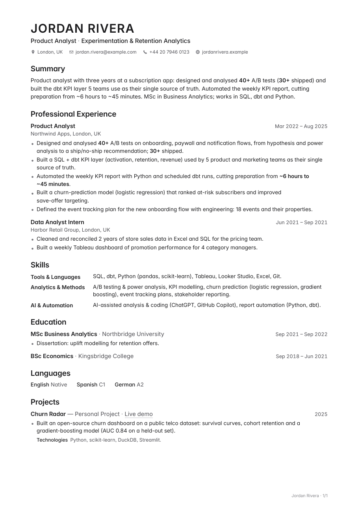

# Docproof

**Fact-grounded documents with automated verification.** Keep every fact about yourself in one
Markdown file, and let a Python CLI and a small team of Claude Code agents build, tailor,
fact-check and typeset documents from it. Every figure in the output is traced back to the fact
base, and the layout is checked before anything leaves your machine.

The reference use case is a CV tailored to a job ad, but the pipeline works for any document
that must stay true to a source: bios, grant CVs, profiles, one-pagers.

<p align="center"></p>

## Why

LLMs are good at rewriting and bad at staying honest. Tailoring a document by hand for the 30th
time is slow; letting a model do it drifts into claims you never made. Docproof separates the two
jobs:

- **A single fact base** (`profile/fact-base.md`) is the only source of truth, including a
  `## Known gaps` list of things you must never claim.
- **Deterministic tools** do the risky parts: they edit Word files surgically and prove that only
  the intended paragraph changed, check every number against the fact base, and verify the
  rendered PDF (page breaks, widows, links, every word present).
- **Agents with separate roles** do the judgment: an author tailors, an auditor checks every claim
  against the fact base, and a context-free reviewer reads it like a stranger would.

## Quick start

Needs Python ≥ 3.9 and Google Chrome or Chromium (for PDF rendering). Poppler (`pdftotext`,
`pdftoppm`) is recommended for page checks and PNG previews.

```bash
git clone https://github.com/MaHmOuDeB/docproof && cd docproof
pip install -e .                 # installs the `docproof` command (no runtime dependencies)
docproof doctor                  # checks Chrome, poppler and fonts
docproof demo                    # build → check → verify → story → match → coverage → prose on the fictional example
docproof init ~/career           # your own private workspace: profile/fact-base.md + resume.json
```

`brew install poppler` on macOS, `sudo apt install poppler-utils` on Debian/Ubuntu. Without
poppler, `pip install -e ".[pdf]"` gives a pypdf fallback for text checks (no PNG previews).

## The CLI

| Command | What it does |
|---|---|
| `docproof build resume.json out.docx` | Build a Word document from JSON in the house template |
| `docproof render doc.docx --out doc.pdf --png previews/` | Typeset a designed PDF (Inter, embedded) with headless Chrome |
| `docproof check doc.docx [--orig base.docx] --png dir/` | Full gate: real .docx, protected header unchanged, every word in the PDF, page starts, widows, links, "tailored-for-the-ad" phrasing |
| `docproof verify doc.docx --facts fact-base.md` | Every figure must appear in the fact base; no "known gap" may be claimed; skills rows are cross-checked |
| `docproof story doc.docx --ad job-ad.txt --facts fact-base.md` | One story: the summary's role matches the title, every title phrase is proven in the body, repeated figures keep their scope, no line re-types the ad, every bullet serves the ad |
| `docproof coverage job-ad.txt --doc cv.docx --facts fact-base.md` | The ATS view: which requirements the document shows, which the fact base could add, which stay open; coverage now → reachable |
| `docproof prose letter.md --kind letter --facts … --ad …` | Cover letters, application emails, LinkedIn headline/About, bios, pitches: figures and known gaps (FAIL), platform limits, stock phrases, "not X but Y", echo, fit |
| `docproof match job-ad.txt --facts fact-base.md` | Requirement → evidence map with a coverage score (≥70% genuine, 50–70% honest middle, <50% stretch) and the gaps |
| `docproof dump / edit / keywords / reorder` | Safe edits: every change is proven to touch only its target |
| `docproof add-entry / add-link / add-summary / set-metadata` | Structural additions that clone the document's own formatting |
| `docproof lint paths… --rules rules.json` | Catch stale facts and rules in your own prompt/skill files |
| `docproof prompt tailor\|audit\|review\|write …` | Paste-ready prompt for ChatGPT, Gemini or any LLM, with all the context (`write` drafts a letter, About, bio or pitch) |
| `docproof apply in.docx reply.json out.docx --facts … --ad …` | Apply an LLM's JSON answer safely, then run `story` and `verify` on it |
| `docproof init [DIR]` | Create a private workspace with fact-base and résumé templates |

Run any command without arguments for its help.

### What `verify` catches

```text
$ docproof verify tailored.docx --facts profile/fact-base.md
numbers   : 14 checked, 1 not in the fact base
  FAIL    '60+'  …Designed and analysed 60+ A/B tests on onboarding,…
known gaps: 1 claimed
  FAIL 'Airflow' in: Automated the weekly KPI report with Python and Airflow, cutting preparation from ~6 hours…
skills    : 0 item(s) with words the fact base doesn't mention
VERIFY FAILED
```

### What `story` catches

A document can pass every fact check and still read wrong. These are the mistakes a hiring manager
notices in seconds, and the ones a model makes when it tailors line by line:

```text
$ docproof story tailored.docx --ad ad.txt --facts profile/fact-base.md
FAIL identity  title says 'Product Analyst' but the summary opens with 'Data scientist'
WARN tagline   title phrase 'Lifecycle Campaigns' is not shown anywhere in the body
WARN scope     summary attaches '5' to 'ran them across', but in the body it belongs to: 'Built a SQL + dbt KPI layer …'
WARN echo      'Analysed experiment results and wrote clear ship/no-ship recommendations' repeats the ad's own wording
WARN relevance 'Built a churn-prediction model …' proves nothing the ad asks for
```

`echo` flags a line that re-types one of the ad's duties; with `--facts`, a line in the fact base's
own wording is never flagged (matching the ad because you really did it is the point). Each WARN
is either fixed or kept with a one-line reason; the agents also run a fresh-eyes review and re-score.

### What `coverage` shows

`match` asks whether you fit the ad; `coverage` asks whether your document shows it, and how far
it can honestly go:

```text
$ docproof coverage ad.txt --doc Jordan_Rivera_CV.docx --facts profile/fact-base.md
✓ shown    Partner with engineering on event tracking and data quality
+ closable Present insights to product leadership
      ↳ fact base: Presented monthly experiment reviews to product leadership.
✗ open     Experience with GA4 and Braze
      ↳ known gap: GA4, Braze — leave it open
coverage now 79% of 12 must-haves → reachable 88% from the fact base (the rest are open gaps)
ad terms the fact base backs but the document never uses: leadership, present
```

Above "reachable", only invention would help, and Docproof never invents.

### Cover letters, LinkedIn, bios and pitches

The same fact base drives the prose around the CV. `docproof prompt write --kind letter|about|…`
gives any assistant the rules; `docproof prose` checks the result:

```text
$ docproof prose letter.md --kind letter --facts profile/fact-base.md --ad ad.txt
FAIL numbers   '60+' is not in the fact base: …I designed and analysed 60+ A/B tests and built GA4…
FAIL gaps      claims the known gap 'GA4': I designed and analysed 60+ A/B tests and built GA4 dashboards.
WARN phrases   stock phrase 'dear sir or madam'
WARN contrast  'It's not just about numbers, it's…'
WARN openers   86% of sentences start with 'I'
```

Saying plainly that a known gap is a gap ("GA4 I haven't used in production") passes. Examples:
[`examples/documents/`](examples/documents/).

### What `match` shows

```text
$ docproof match examples/jobs/experimentation-analyst.txt --facts examples/profile/fact-base.md
✓ evidence 0.62  Design A/B tests with product managers, including power analysis and success m
      ↳ Designed and analysed 40+ A/B tests on onboarding, paywall and notification flows, from
✓ evidence 1.00  Strong SQL; experience with dbt
✗ gap      0.00  Experience with GA4 and Braze
      ↳ known gap: GA4, Braze
coverage: 77% of 13 requirements — genuine match
```

## Use it with any AI assistant

The CLI contains no AI and runs on its own. The assistant only proposes; the tools check.

| You use | How |
|---|---|
| **Claude Code** | `scripts/install.sh`, then `/tailor <job ad>` — see the agents below |
| **Codex CLI, Gemini CLI, Cursor** | open the repo (or your workspace) — they read [`AGENTS.md`](AGENTS.md) / [`GEMINI.md`](GEMINI.md) and drive the CLI |
| **ChatGPT, Gemini, Claude.ai (in the browser)** | `docproof prompt …` builds a paste-ready prompt with your fact base, the ad and the match report; `docproof apply` applies the JSON answer and verifies it |

```bash
docproof prompt tailor --facts profile/fact-base.md --ad ad.txt --doc profile/base.docx --out prompt.txt
# paste prompt.txt into ChatGPT / Gemini, save its JSON answer as reply.json, then:
docproof apply profile/base.docx reply.json Jordan_Rivera_CV.docx --facts profile/fact-base.md
docproof check Jordan_Rivera_CV.docx --orig profile/base.docx --png previews/
docproof prompt audit  --facts profile/fact-base.md --doc Jordan_Rivera_CV.docx   # second opinion on every claim
docproof prompt review --doc Jordan_Rivera_CV.docx --persona "hiring manager"      # fresh eyes, no fact base
```

If the model invents a number or claims a known gap, `apply` fails the verification and names it.

## The Claude Code agents

`scripts/install.sh` copies the Claude side into `~/.claude/` (or `--project` for `./.claude/`):

| | Role |
|---|---|
| `doc-craft` skill | How CVs are read, section-by-section rules, bullet writing, honest tailoring, requirement coverage and how ATS really work, layout rules, English and German conventions, cover letters, LinkedIn/bio/pitch writing, review modes |
| `document-tailor` agent | Go/no-go with `match`, tailors section by section through the CLI, and cannot finish until `verify`, `story` and `check` pass, the PNGs have been looked at and a fresh-eyes review has been applied and re-scored |
| `claim-auditor` agent | Independent line-by-line claim audit against the fact base (numbers, tools, "led" vs "supported"); never edits |
| `fresh-eyes-reviewer` agent | Reviews with **no** access to the fact base, as a named persona (recruiter, hiring manager…); run 2–3 in parallel |
| `/tailor <job ad>` | Runs author → auditor → reviewer and triages the findings |
| `/letter [kind] <job ad>` | Cover letter, application email, LinkedIn headline/About, bio or pitch: drafted from the fact base, checked with `prose`, critiqued once, revised |

See [`claude/README.md`](claude/README.md) and [`docs/architecture.md`](docs/architecture.md).

## Your own fact base

Start from [`examples/profile/fact-base.md`](examples/profile/fact-base.md) (a fictional
candidate) and [`examples/resume.json`](examples/resume.json). Keep yours **outside** this
repository or in a private fork — `profile/` and `applications/` are git-ignored by default.

## Design rules baked in

- Never invent experience: a fact that isn't in the fact base doesn't go in a document.
- Trim words, never drop numbers.
- One story: the title, the summary and every bullet sell the same role; a line that doesn't serve
  the ad gives its space to one that does.
- The reader wrote the job ad — the document never shows that it was tailored.
- Emphasis budget: at most two bold items per bullet (one key phrase plus figures).
- Short sections and entries with ≤ 4 bullets never split across pages; no one-word widows.
- Tighten wording instead of shrinking type.
- Always look at the rendered pages.

## Development

```bash
python -m unittest discover -s tests -v
docproof lint claude --rules examples/lint-rules.json
```

CI runs the tests (including a real Chrome render) and the demo on every push.

## License

MIT for the code. The bundled Inter font is under the SIL Open Font License
(`src/docproof/assets/fonts/LICENSE.txt`).
