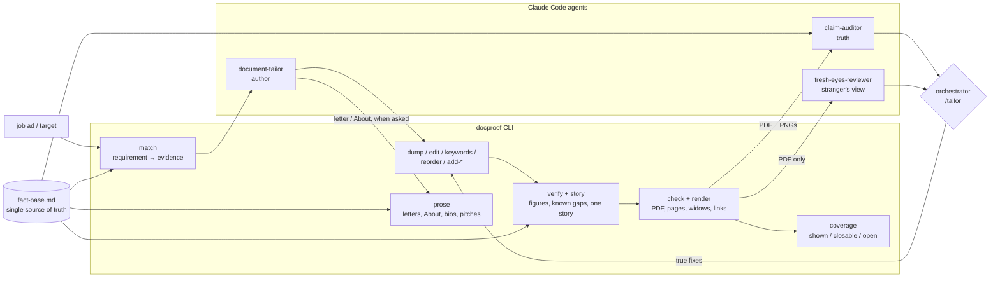

# Architecture

Docproof has two layers: deterministic tools that can prove what they did, and agents that make
judgment calls on top of them. Nothing an agent writes reaches the reader without passing the
tools' gates.

## Gates

| Gate | Tool | Fails when |
|---|---|---|
| Structure | `inspect` | the file isn't a real .docx, or no body heading is found |
| Header | `header-diff` | anything in the protected header changed except the title line |
| Every edit | `edit`, `keywords`, `reorder`, `add-*` | the change touches more than its target (each tool diffs before/after) |
| Truth | `verify` | a figure isn't in the fact base, or a known gap is claimed |
| One story | `story` | the summary's role contradicts the title (FAIL); unproven title phrases, figures out of scope, lines echoing the ad, bullets that serve nothing (WARN) |
| Coverage | `coverage` | reports; never fails: requirements shown, closable from the fact base, or open |
| Prose | `prose` | a letter/About/bio/pitch has a figure not in the fact base, claims a known gap or exceeds a platform limit (FAIL); stock phrases, "not X but Y", echo, weak fit (WARN) |
| Rendering | `render` | a word of the .docx is missing from the PDF text |
| Layout | `check` | a page starts mid-entry, a bullet ends on one word, "tailored" phrasing appears (WARN) |
| Eyes | the agent | nobody looked at the PNGs |

## Without Claude Code

The same loop works with any assistant: `docproof prompt tailor` packs the fact base, the ad, the
`match` report and the document into one prompt that asks for a JSON list of edit operations;
`docproof apply` runs them through the same safe editors and then `verify`. `prompt audit` and
`prompt review` recreate the auditor and the fresh-eyes reviewer as paste-ready prompts, and
`prompt write` drafts a cover letter, About section, bio or pitch for `prose` to check. Coding
agents (Codex CLI, Gemini CLI, Cursor) get their instructions from `AGENTS.md`.

## Why the agents are separate

- The **author** is optimising for fit, which is exactly the pressure that produces overclaiming.
- The **auditor** sees the fact base and only asks "is this true as written?" It never edits.
- The **reviewer** is deliberately denied the fact base and any memory, so it reads the document
  the way a recruiter does. Two or three personas in parallel disagree usefully.

The orchestrator (you, or `/tailor`) triages the auditor's and reviewers' findings against the
fact base, applies only the true fixes through the CLI, and re-runs the gates.

## Document model

The tools read and write `word/document.xml` directly, never re-serialising through a library,
so everything not explicitly edited stays byte-identical. A document is:

- a **header table** (name, title line, contact line, optional photo) — protected except the title;
- **ALL-CAPS section headings** (English and German sets, see `src/docproof/headings.py`);
- entries: a bold **role** line followed by a `company ⇥ date` line, or a bold `title ⇥ date` line;
- real list-numbered **bullets**, `Label: items` **skill rows**, and `Technologies:` **meta** lines.

`docproof build` writes exactly this structure; documents made elsewhere work if they follow it.
